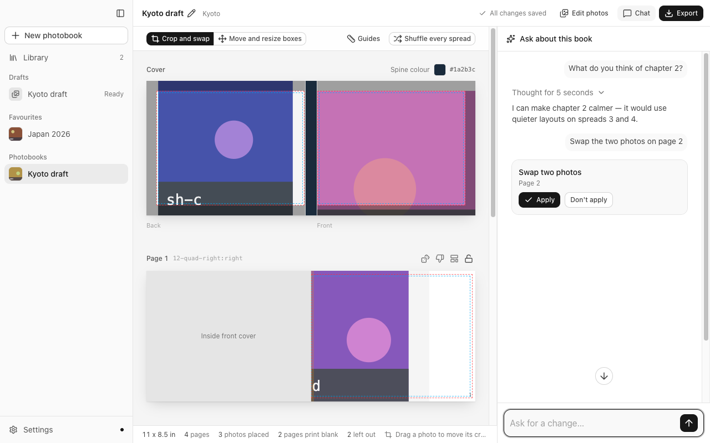
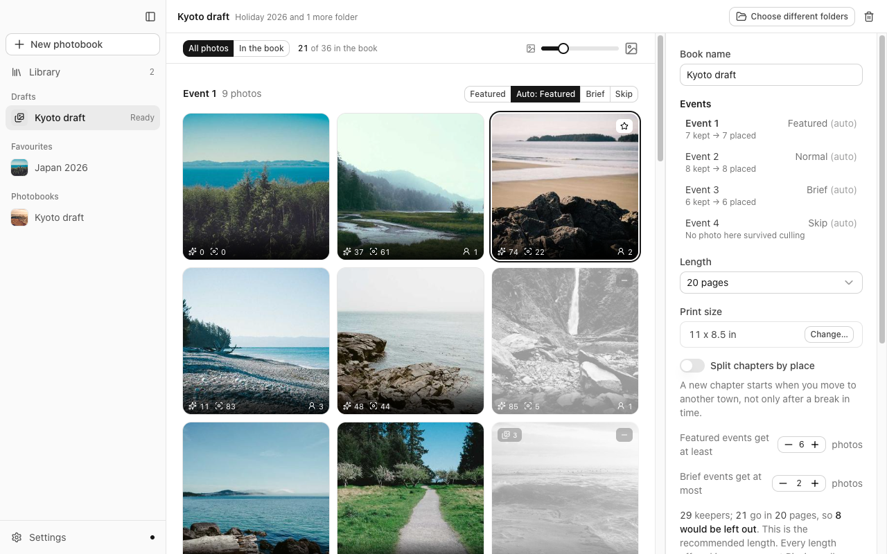
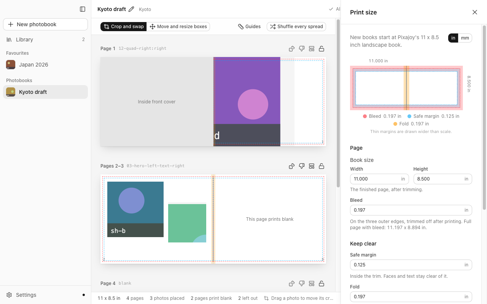

<p align="center">
  
</p>

<h1 align="center">PhotobookGen</h1>

<p align="center">
  Turn a folder of photos into a print-ready photobook, analysed entirely on your Mac.
</p>

<p align="center">
  <a href="https://github.com/Ripwords/photobook-generator/releases/download/v0.1.2/PhotobookGen_0.1.2_aarch64.dmg"></a>
  <br /><br />
  <a href="https://github.com/Ripwords/photobook-generator/releases/latest"></a>
</p>

<p align="center">
  
</p>

Pick your photo folders. PhotobookGen ranks every photo with Apple Vision, drops look-alikes
and utility shots, and lays out a varied book spread by spread. You fine-tune it, then export
one cropped file per photo plus a `manifest.json`, ready to upload to your printer.

## Features

- **On-device analysis.** Faces, aesthetics, sharpness, saliency and scene tags from Apple
  Vision. RAW, HEIC and JPEG.
- **Smart culling.** Near-duplicates collapse to the best frame, and the book favours variety
  over density.
- **Full control.** Include or exclude any photo. Regenerate, lock or shuffle spreads, swap
  photos, crop, and move or resize boxes. Edits that would cut a face or print blurry are
  refused with the reason.
- **Front and back cover.** Generating a book picks both, cropped to the panel including the
  wrap that folds under the board, with a plain spine colour taken from the front photo.
  Swap, re-crop or clear either side.
- **Chapters by place.** Optional, off by default. A move of more than 25 km ends a chapter,
  and each one is titled with its town.
- **Any printer.** Page size, bleed, margins and DPI are set per book. Pixajoy's 11 × 8.5" is
  the default.
- **Pre-flight export.** Anything that would print badly blocks the export.
- **Optional AI chat.** Ask for layout changes in plain words. Every edit waits for your
  approval. Uses your own DeepSeek key.

| Choose the photos | Set the print size |
|---|---|
|  |  |

## Install

Requires macOS 15+ on Apple Silicon. Download the dmg above and drag **PhotobookGen** to
**Applications**.

The app isn't notarized, so macOS blocks the first launch (sometimes calling it "damaged").
Right-click the app and choose **Open**, or run:

```bash
xattr -dr com.apple.quarantine /Applications/PhotobookGen.app
```

It updates itself after that.

## Privacy

**Your photos never leave your Mac.** The chat, if you turn it on, sends only a text
description of the book (layouts, page numbers, photo tags) to the provider you add a key
for. Keys live in the macOS keychain. Your originals are never modified.

Chapters by place, if you turn it on, asks Apple for a town name. It sends one point per
chapter, rounded to about a kilometre, and never a photo. With the switch off nothing is
sent. Town names stay on your Mac and are never included in what the chat sees.

## Status

Usable end to end, but not yet proven against a printed book. The cover and location
clustering are built. Same-person grouping is blocked: Apple's on-device face data does not
separate people reliably (0.705 AUC over 555 labelled faces), and the usual alternative
model is licensed for research only. See
[`docs/PROJECT-STATUS.md`](docs/PROJECT-STATUS.md) for the full record.

## Docs

- [User manual](docs/manual.md) covers every screen, control and shortcut.
- [Development](docs/development.md) covers building, testing, benchmarks and releases.

```bash
bun install && bun run dev
```
