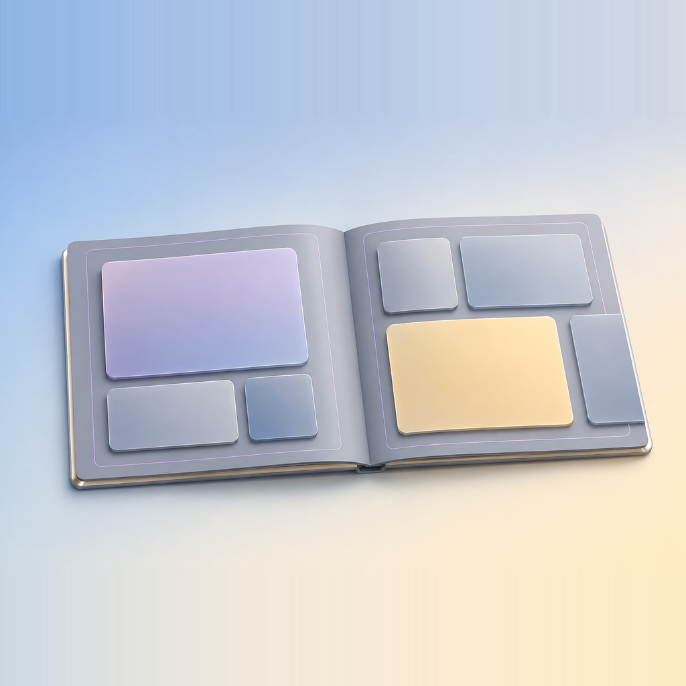

<p align="center">
  
</p>

<h1 align="center">PhotobookGen</h1>

<p align="center">
  Turn a folder of photos into a print-ready photobook, analysed entirely on your Mac.<br />
  <a href="https://v2.tauri.app/">Tauri 2</a> · <a href="https://nuxt.com/">Nuxt 4</a> · <a href="https://ui.nuxt.com/">Nuxt UI</a> · <a href="https://developer.apple.com/documentation/vision">Swift / Apple Vision</a>
</p>

<p align="center">
  <a href="https://github.com/Ripwords/photobook-generator/releases/download/v0.1.1/PhotobookGen_0.1.1_aarch64.dmg"></a>
  <br /><br />
  <a href="https://github.com/Ripwords/photobook-generator/releases/latest"></a>
</p>

Point PhotobookGen at one or more folders of photos. It analyses every photo on this Mac
with Apple Vision, drops the utility shots and look-alikes, picks a varied set, and lays it
out spread by spread on a curated template library designed for Pixajoy's 11 × 8.5" landscape
book. Each book has its own print size, so another printer's page, bleed and margins work too.
You adjust the book as it will print, then export one cropped file per photo placement plus a
`manifest.json`, ready to upload to the printer. The app never talks to a printer itself.

A macOS-only desktop app: Tauri 2 (Rust) and Nuxt 4, backed by a Swift sidecar
(`sidecar/`, SwiftPM package `PhotobookEngine`) that performs the photo analysis and the
export crops.

## Features

- **On-device analysis.** Apple Vision aesthetics, faces with pose and capture quality,
  saliency, horizon, scene tags and text, plus sharpness, palette, perceptual hash and
  feature prints. RAW, HEIC and JPEG. Nothing is uploaded.
- **Several folders, one book.** Photos from every folder are ranked together and grouped
  into events by the time they were taken, whichever folder they came from.
- **Look-alike culling.** Shots of the same picture taken within two minutes collapse to
  one: the sharpest, unless it is almost entirely black or blown out and a properly exposed
  frame exists.
- **Variety over density.** About four photos per spread, the best photo of every moment
  before a second from any, sparse spreads mixed with the occasional six-up.
- **Your call on every photo.** Include or exclude any photo on the contact sheet; the app
  recommends the shortest Pixajoy length that fits and says what each length would leave out.
- **Spread controls.** Regenerate, reject, choose a layout by name, lock, and shuffle the
  whole book around the locked openings.
- **Hand editing.** Swap photos, replace one with any other, drag and scroll to crop, and
  move or resize the boxes with snapping to the trim, safe and gutter guides. Every edit that
  would cut a face, put one in the fold or print below the book's lowest print resolution is
  refused with the reason.
- **Print size per book.** Page size, bleed, safe margin, fold and resolution limits, in
  inches or millimetres. New books start at Pixajoy's 11 × 8.5". Changing a laid-out book
  keeps every layout and edit, and says first what would stop printing well.
- **Pre-flight export.** Anything that would print badly blocks the export and is listed.
- **Library.** Covers or a list, search, sort, favourites, rename, a 30-day trash with undo,
  and drafts that keep analysing in the background.
- **Bounded cache.** Analysis results and previews stay under a limit you choose, without
  ever evicting a photo a saved book needs.
- **Book chat (optional).** A chat beside the book proposes layout edits, and every write
  waits for your approval. It needs your own DeepSeek API key. Replies stream in as they
  arrive. If the model thinks before answering, its thinking streams first under
  **Thinking…** and folds away to **Thought for N seconds** once the reply starts. DeepSeek's
  thinking mode is switched off in `app/agent/agent.ts` because it bills as output, so today
  you only see it if that is turned on.

## Status

The app is usable end to end, but it has not yet been proven against a printed book.
[`docs/PROJECT-STATUS.md`](docs/PROJECT-STATUS.md) holds the full record, including what is
verified and what is only assumed.

| Phase | Scope | State |
|---|---|---|
| 1 | On-device analysis pipeline | Complete |
| 2 | Cull, pack, score, crop, pre-flight, export, save | Complete and verified against fixtures. Nobody has yet uploaded an exported page to Pixajoy, so whether Pixajoy accepts every exported format (PNG in particular) is unconfirmed. |
| 3 | Spread preview and spread-level controls | Built |
| 4 | Canvas editor | Partly built. Hand cropping and moving or resizing boxes work. Adding or removing boxes and text zones do not exist. |
| 5 | Chat agent driving the layout tools | Chat panel built (DeepSeek, with an optional Jev key). |

Not built: the cover (its wrap band and spine are a different geometry), GPS location
clustering, same-person face clustering, and zero-shot mood tagging. Four scoring terms ship
at weight zero until they are tuned on real photographs.

## Privacy

**Images never leave your Mac.** All pixel analysis runs on-device in the Swift sidecar;
there is no hosted vision model. Only derived JSON is ever sent anywhere, and only to the
chat provider you configure a key for: DeepSeek reads a description of the book (its
layouts, page numbers and photo tags) plus your messages, and the optional Jev key lets
Jev check proposed edits and find photos by description from the same derived data.
Without a key, nothing is sent. API keys live in the macOS keychain. The analysis cache
holds results and small previews, never your originals, and your originals are never
modified.

## Requirements

- macOS 15 or later
- Apple Silicon (arm64). There is no Intel or universal build.

## Installing

Download the dmg from the [latest release](https://github.com/Ripwords/photobook-generator/releases/latest),
open it, and drag **PhotobookGen** to **Applications**.

The app is not notarized (there is no Apple Developer ID behind it), so Gatekeeper blocks
the first launch, sometimes reporting the app as "damaged". It is not. Either right-click
the app in Finder and choose **Open**, then **Open** again in the dialog, or clear the
quarantine flag:

```bash
xattr -dr com.apple.quarantine /Applications/PhotobookGen.app
```

After that it opens normally.

PhotobookGen keeps itself current from there. It asks GitHub for a newer release once at
launch, and again whenever you press **Check for updates** in **About** (see below), then
downloads the one it finds and restarts into it. An update whose signature does not match
this project's key is refused, so a tampered download cannot install itself. The launch
check is quiet: offline, or with nothing newer out, it says nothing at all.

## Using the app

The window is a sidebar and one screen beside it. The sidebar is always there (⌘B hides
and shows it): **New photobook** at the top, **Library** under it, then **Drafts** (books
still being analysed or chosen, shown only when there are any), then **Favourites** (books you
starred, shown only when there are any), then every other book you have made, each with its
cover, and **Settings** at the bottom. Click a book or a draft there to open it from wherever
you are. Right-click a book there for the same menu the library gives it (see below). Hover any icon button for its name and, where it has one, its shortcut.

| Shortcut | Does | Where |
|---|---|---|
| ⌘N | New photobook (name it, then choose photo folders) | Anywhere |
| ⌘B | Show or hide the sidebar | Anywhere |
| ⌘, | Settings | Anywhere |
| ⌘J | Show or hide the chat | Book editor |
| ⌘E | Export | Book editor |

**Settings** has three tabs. **General** sets the appearance (System, Light or Dark),
manages storage, and lists the shortcuts above. **API keys** is where the chat's keys are saved. **About**
shows the version and what leaves this Mac: no image ever does, and the chat sends only a
description of the book (its layouts, page numbers and photo tags). **About** also holds
updates. **Check for updates** asks now and answers either way, and a waiting update shows
its version and release notes there with **Install and restart** beside **Not now**. When
the quiet launch check is the one that found it, a dot appears on **Settings** in the
sidebar and clicking through opens this tab.

**Storage** (in **General**) shows how much disk the analysis cache uses against its
limit. The cache is every analysed photo's results plus the small preview image the contact
sheet shows, about 34 KB per photo; your original photos are never in it and never touched.
The limit is 2 GB unless you pick another (500 MB, 1 GB, 2 GB, 5 GB or 10 GB). When the cache
is over it, the app removes the photos no book or draft uses, least recently analysed first,
at startup and after each analysis. It never removes a photo that a saved book, a book
deleted within the last 30 days, a draft, or the photos on screen use, because the book
could not open without it. If those alone are over the limit, the section says so and
nothing they use is removed. **Clear unused** removes every photo nothing uses, straight
away. A removed photo is analysed again the next time its folder is chosen. Results
from an older version of the analyser are removed regardless of the limit, since the app can
no longer use them.

### 1. The library

The screen the app opens on: every book you have made, as covers built from its own photos.
The two buttons at the top right switch between covers and a list, which also shows each
book's source folders and last export. Search matches a book's name or any of its folder
names; the sort menu orders by last edited, date created, or name.

Click a book to open it. Right-click it, or hover and click **…**, for **Open**, **Add to
favourites** (or **Remove from favourites**), **Rename…**, **Show photos in Finder** (a
submenu naming each folder when the book draws on several), **Show export in Finder** (only
once the book has been exported) and **Delete…**. A starred book shows a star beside its name
and sits in the sidebar's **Favourites** group; starring does not change its last-edited
date. In the library, Rename edits the name in place: Return saves, Escape cancels. From the
sidebar it opens a small dialog instead, and renaming the book you have open updates its
title in the editor too. Deleting the book you have open returns you to the library. Deleting asks
first, then removes the book, with a notice offering **Undo**. A deleted book is kept for 30
days before its layout, your include/exclude decisions and its export history are gone for
good, though only that notice can bring it back. Files you already exported to disk are not
touched. The photo analysis cache keeps the book's photos while it is in the trash; after
that they count as unused, so reopening those folders re-analyses only the photos that
**Storage** has since removed.

With no books yet, the library is a short explanation of the three steps and a **New
photobook** button, which does the same as the one in the sidebar.

**New photobook** asks for the book's name first, then its photo folders (**Choose
folders…**, and **Add folders…** for more; **×** removes one). **Start** is enabled once
there is a folder. A blank name becomes the first folder's name, which the field shows as its
placeholder.

### 2. Choosing the photos

Starting a book opens it as a **draft**. Every supported image in them and in their subfolders is analysed
on this Mac (nothing leaves the machine). Several folders are one set: every photo is ranked
against all the others, and photos shot the same afternoon fall into one event whichever
folder they came from.

When you shot the same picture several times within two minutes, the app keeps one: the
sharpest, unless it is almost entirely black or blown out and a properly exposed frame
exists.

The contact sheet shows every photo with the ones the book would leave out dimmed. Use **+**
and **−** on a photo to include or exclude it yourself. The bar above the sheet stays pinned
while you scroll it: **All photos** or **Keepers only**, the keeper count, and the tile
size. The panel on the
right is the book itself: name it, pick a length and, under **Print size**, **Change…** the
page size (the same panel as in the editor, without the dry run), and below that are the selection
counts and a key to the marks on the tiles. **Choose different folders** at the top starts
again from other folders. The app recommends the shortest Pixajoy length that fits the keepers and says
how many each length would leave out.

The book aims for variety over density. It places about four photos per spread, so a
40-page book places around 85 rather than the 130 its layouts could squeeze in, and it mixes
sparse spreads with the occasional six-up. Photos taken within two minutes of each other
count as one moment: the book takes the best photo of every moment before a second from any,
and never more than two from one moment unless you marked the others **+**. The photos this
leaves out are still one click away in the editor, under **Choose any photo…**. A length that cannot hold every photo you explicitly
marked **+** cannot be generated at all, and says so instead of quietly dropping one.

**Generate book** saves the book, opens it in the editor, and removes the draft.

You can leave a draft at any point, including while it is still being analysed. It stays in
the sidebar's **Drafts** group: a spinner and a photo count while it analyses, **Ready** when
it is done, **Failed** if it could not be analysed. Its name and your include and exclude
choices are kept, so you can start another book, or open one, while it works; several drafts
analyse at once, taking turns. When one finishes while you are elsewhere, a notice says it is
ready, with **Open** to go to it. The trash button at the top right of the draft,
**Discard draft**, throws it away after asking.

Drafts are saved as you go, with their names, folders and your choices, and come back when
the app is reopened. A draft that was still analysing when you quit starts again; the
analysis is cached, so photos it already reached are quick.

Arriving here from **Edit photos** on a saved book is the same screen, as a draft named after
that book, with its decisions restored once the analysis is done (**Edit photos** again
reopens the same draft), and the generate control becomes two: **Update "<name>"** replaces the
saved book (its export history goes with it), **Save as a new photobook** keeps both.
Choosing different folders makes it a new book again, since a book built from a different
source is not an update of the old one.

### 3. Editing the book

The book, spread by spread, as it will print. **Everything on this screen is written to disk
as you do it** (the check beside the title says when it last saved), so there is nothing to
save and you can leave whenever you like through the sidebar.

The toolbar at the top holds the title, with a pencil to rename the book; **Edit photos**,
which takes its photo selection back to the contact sheet and re-analyses the book's own
folders (every photo a cache hit, no new Vision work); **Chat** (⌘J), which shows or hides
the chat beside the book; and **Export** (⌘E). The bar along the bottom starts with the book's
print size (for example **11 x 8.5 in**), then counts its pages, the photos placed, any blank
pages and the photos left out, and says what dragging a photo does in the current mode.

Every opening (page 1, each pair of facing pages, the last page) has four controls on its
right. Page 1 is shown facing the inside front cover and the last page facing the inside
back cover, the way the printed book opens.

- **Regenerate** (dice) lays the same photos out on a layout this opening has not shown
  yet. Click again to see the next one; when every layout for that many photos has been
  shown, the button is disabled.
- **Reject** (thumbs down) does the same, and never offers the current layout here again.
- **Choose a layout** (grid) lists the other layouts that hold this many photos by name.
- **Lock** keeps the opening exactly as it is: **Shuffle** at the top of the book re-lays
  every unlocked opening at once and skips locked ones, and a locked opening refuses every
  other change until unlocked.

To **swap two photos**, click one, then click another anywhere in the book; click the
first again or press Escape to cancel. To **use a photo the book left out**, click the photo
to replace, then **Choose any photo…** in the bar at the bottom. The dialog opens on the
photos no page uses, each shown cropped the way that slot would print it; **In the book** and
**All** show the rest, sorted **Best first** or by **Time taken**. Pick one and press
**Replace**, or double-click it. Picking a photo that is already on another page reads **Swap
with page N** and exchanges the two. A photo that would cut a face, put one in the fold or
the trim margin, or print too small is dimmed with the reason and cannot be picked, and so
are photos on a locked spread. To **adjust a crop**, drag the photo inside its
slot to move the window, or scroll over it to zoom; the window keeps the slot's shape and
is saved when you let go. Regenerating that opening or swapping the photo away recomputes
its crop, because the slot it was chosen for is gone.

To **move or resize the boxes themselves**, switch the bar above the book from **Crop and
swap** to **Move and resize boxes**. Drag a box to move it, drag a corner to resize it; edges snap to the trim, safe and
gutter guides, the page edge (which prints as bleed) and the other boxes on the page. A box
cannot leave the page, shrink below 5% of it, or overlap another box, and the photo is
re-cropped for the new shape under the same rules as everything else. Switch back to **Crop
and swap** to go back to swapping and cropping. A change that would cut a face, put one in the
gutter or the safe margin, or print below the book's lowest print resolution is refused with
the reason, and the book stays as it was.

**Print size.** Click the size at the left of the bottom bar to open the **Print size** panel
beside the book. It holds what a printer publishes: the **Book size** (width and height of
the finished page after trimming), the **Bleed** on the three outer edges, the **Safe margin**
inside the trim and the **Fold** strip measured in from the binding, and the **Lowest** and
**Target** print resolution in DPI. Below the lowest, export stops; below the target, it
warns. **in** and **mm** at the top switch every length between inches and millimetres; that
is a display choice only and never changes the book. At the top of the panel, a drawing of
one spread labels the trimmed width and height and shades the bleed (red), safe margin (blue)
and fold (amber) in the same colours as the editor's guides, with each value in the legend.
The band for the field you are editing lights up. Thin margins are drawn wider than scale so
they stay visible, and the drawing says when it has done that; the numbers are exact. While
a field holds something the app cannot build with, the drawing dims and keeps the last valid
size. While you type, the book behind the
panel redraws its page shape and trim, safe and fold guides at the new numbers, and the panel
says what would fail at that size, for example "At this size, 3 problems would block the
export", with the list. Anything the app cannot build with (a blank field, a margin that
leaves no room for photos, a target resolution at or under the lowest) is refused with the
reason and **Change print size** stays disabled. When the dry run finds problems the button
reads **Change print size anyway**: the change is always allowed, and export will block
until they are fixed. Applying keeps every layout, lock, swap and moved box; only the crops
are recomputed when the page's shape changed, including crops you adjusted by hand.
**Shuffle** or **Regenerate** re-lay openings against the new size if you want that.
**Reset to Pixajoy 11 x 8.5** appears once the numbers differ from the default.

The built-in layouts were drawn for a landscape page. A portrait or square size is allowed,
and the panel says so: the layouts still fit but were not composed for that shape. A size is
set per book. A new book starts at Pixajoy's size, not at the last book's; set it on the
draft screen under **Print size** before generating, or here afterwards. Starting new books
from the last book's size is a possible later change, not an oversight.

**Export** opens a sheet from the right. Choose an output folder and export. Pre-flight
runs first, at the book's print size; anything that would print badly blocks the export and
is listed in the sheet. The output is one cropped file per photo placement plus a
`manifest.json` saying what went where, ready to upload to the printer.

## Development

Requires an Apple Silicon Mac on macOS 15+, [Bun](https://bun.sh) (the package manager,
not npm), a stable Rust toolchain for `aarch64-apple-darwin`, and Xcode or the Swift
toolchain for the sidecar package.

```bash
bun install
bun run sidecar     # build the Swift sidecar first; every cargo command needs it
bun run dev         # the desktop app
```

`bun run dev` and `bun run build` also build the sidecar themselves, through Tauri's
`beforeDevCommand` and `beforeBuildCommand` hooks in `src-tauri/tauri.conf.json`.

```bash
bun run test        # frontend tests (Vitest)
bun run test:rust   # Rust tests (cargo test)
bun run test:swift  # Swift sidecar tests (swift test)
bun run lint        # oxlint; warnings are failures
bun run check:build # nuxt generate, the only step that compiles .vue files
bun run build       # PhotobookGen.app and the dmg, under src-tauri/target/.../bundle/
```

Run `bun run check:build` before committing any change to a `.vue` file: lint and the
tests never parse a Vue template, so a broken component passes both. CI runs every command
above except `build` on each push and pull request.

Contributor notes, conventions and the traps that already caused real bugs are in
[`CLAUDE.md`](CLAUDE.md) and [`docs/PROJECT-STATUS.md`](docs/PROJECT-STATUS.md).

<details>
<summary><strong>Building or testing the Rust crate directly</strong></summary>

`src-tauri/tauri.conf.json` declares the sidecar binary under `bundle.externalBin`. This
makes `tauri-build`'s build script validate, **at compile time**, that
`src-tauri/binaries/photobook-engine-<target-triple>` exists on disk, before any Rust
code is compiled.

If you invoke `cargo build` or `cargo test` **directly** inside `src-tauri/` (bypassing
the `bun run dev` / `bun run build` hooks), build the sidecar first:

```bash
bun run sidecar
cargo test --manifest-path src-tauri/Cargo.toml
```

Skipping this produces an error like:

```
resource path `binaries/photobook-engine-aarch64-apple-darwin` doesn't exist
```

which points at the missing binary, not at the missing `bun run sidecar` step.

</details>

<details>
<summary><strong>Driving the UI in a browser (<code>bun run ui:mock</code>)</strong></summary>

`bun run ui:mock` opens the webview in an ordinary browser on port 3123 with the Tauri
bridge replaced by `dev/tauri-mock/`, so a UI change can be rasterised and looked at, or
driven by a browser automation tool, without a Tauri process. Every command the UI can
reach is answered, from the wire fixtures where one exists and from
`dev/tauri-mock/photos.ts` for a whole analysed folder, so all three screens and the flows
between them can be driven end to end. Set `window.pbgCancelPicker = true` to make the next
folder pick resolve to nothing. Nothing in the production build sees this alias.

`bun run ui:dev` runs the plain Nuxt dev server without the mock.

</details>

<details>
<summary><strong>Benchmarking photo analysis performance</strong></summary>

`scripts/benchmark.sh <folder>` drives the sidecar's `benchmark` NDJSON request (alongside
`ping` and `analyze`; see `sidecar/Sources/PhotobookEngine/Protocol.swift`) over every
supported image in a folder and reports per-stage wall-clock timings: file hash, EXIF read,
decode, Vision pass, classical metrics, and (optionally) thumbnail write. It prints a
per-file table and a per-extension aggregate, so RAW, HEIC and JPEG throughput are directly
comparable instead of blended into one number.

This is a permanent diagnostic, not scaffolding. Re-run it after any change to
`ImageLoader`, `Analyzer`, `VisionAnalyzer` or `Metrics` to catch a throughput or
correctness regression before it ships. It is also how the RAW decode performance fix was
measured; see
`.superpowers/sdd/2026-08-12-phase-1-analysis-pipeline/raw-performance-report.md` for the
baseline-vs-fix numbers, the per-format embedded-preview fallback rates, and a quality
comparison between the preview-decode and full-decode paths on real RAW files.

```bash
bun run sidecar                                    # builds the sidecar binary if needed
scripts/benchmark.sh ~/Pictures/SonyImport --recursive
scripts/benchmark.sh sidecar/Fixtures --limit 20    # quick smoke test, no real photos needed
```

Flags:

- `--recursive` descends into subfolders, as the app's own folder scan does (real photo
  exports are often nested).
- `--limit N` benchmarks only the first N matching files.
- `--thumbnails DIR` also times the contact-sheet thumbnail write stage, writing into
  `DIR`. Omitting it skips that stage, which is the default: most throughput questions are
  about decode and Vision, not thumbnail writing.
- `--json OUT.json` dumps the raw sidecar response alongside the printed tables.

Requires `jq`. The script builds the sidecar binary automatically (via `bun run sidecar`)
if `src-tauri/binaries/photobook-engine-<target-triple>` doesn't exist yet.

Benchmark runs are deliberately **sequential**, not the concurrent `concurrentPerform`
fan-out a real `analyze` batch uses (see `Benchmarker.swift`'s doc comment). That makes
per-stage numbers clean and comparable across formats, but a benchmark run's total wall
time under-represents real multi-core throughput. Judge real-world speed by the aggregate
ratios and per-format comparisons, not the raw total.

#### Timing what the user waits for

`scripts/benchmark.sh` times the sidecar's stages one photo at a time. To time the app's own
analysis path (Rust hashing and cache lookup, the batched sidecar calls, finalize) over a
folder, cold and then with every photo cached:

```bash
bun run sidecar
cd src-tauri && cargo run --release --example analyze_bench -- ~/Pictures/SomeFolder 3
```

It points `HOME` at a throwaway directory, so the app's real cache is never touched, and
discards a first run that spawns the sidecar. Each run logs its split, for example
`gather 419ms = hash+lookup 44ms + sidecar 370ms`, and the app writes the same line to its
log for every analysis.

To time a folder the app has already analysed without running Vision on it again, point
`PBG_BENCH_SEED_DB` at a copy of the app's database (`sqlite3 <database> ".backup copy.sqlite"`).
Every run then starts from that cache. The first run is the one after a restart. The first
run after upgrading from a version without file stamps reads every file once.

</details>

## Releases

```bash
bun run release 0.2.0   # explicit version (recommended)
bun run release         # changelogen picks the next version from the commits
bun run release --minor # force a patch, minor or major bump
```

`scripts/release.mjs` writes the version into `package.json`, `src-tauri/tauri.conf.json`,
`src-tauri/Cargo.toml` and `src-tauri/Cargo.lock`, and updates `CHANGELOG.md` with
[changelogen](https://github.com/unjs/changelogen). It refuses to continue if any of those
fields is missing. It then commits `chore(release): v<version>`, tags `v<version>`, and
pushes both.

The tag starts [`.github/workflows/release.yml`](.github/workflows/release.yml). It opens a
draft release named `PhotobookGen v<version>` with changelogen notes, builds
`PhotobookGen_<version>_aarch64.dmg` on a macOS 15 Apple Silicon runner, and uploads it with
the updater archive and its `latest.json`. It publishes the release only once CI has passed
on the tagged commit. It does not run CI again. It waits for the run that pushing the release
commit to master already started. A tag on a commit that was never pushed to master has no
such run, so the release stops there. The dmg builds while CI runs. If CI fails, the release
stays a draft that users and the updater cannot see, and you delete it along with the tag.

After publishing, the workflow points the download button at the top of this README at the
new dmg and pushes that as a `docs(readme)` commit from `github-actions[bot]`. Pull before
your next commit. The button changes only once the dmg exists, so it never links to a
release that failed. The stamp (`scripts/stamp-readme.ts`) refuses a README that does not
hold exactly one download link, rather than shipping a dead button.

Running the workflow by hand from the Actions tab builds the dmg and attaches it to the run
as an artifact, without creating a release.

### Updater signing

The updater trusts one minisign keypair. The public half sits in
`src-tauri/tauri.conf.json` under `plugins.updater.pubkey`, and the app refuses any update
whose signature it cannot verify. The private half lives only in the repository secrets,
`TAURI_SIGNING_PRIVATE_KEY` and `TAURI_SIGNING_PRIVATE_KEY_PASSWORD`, and the release
workflow reads them when it builds. A new keypair comes from `bunx tauri signer generate -w
<path outside the repo>`; replacing the public key in the config means every already
installed copy stops accepting updates and has to be reinstalled by hand, so rotate it only
when the private key is compromised.

This is Tauri's own signing, not Apple's. The bundle still has no Developer ID and is not
notarized, which is why the first launch needs the Gatekeeper step under
[Installing](#installing).
